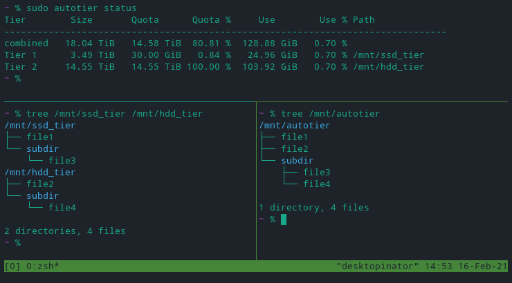

# autotier
A passthrough FUSE filesystem that intelligently moves files between storage tiers based on frequency of use, file age, and tier fullness.

## What it does
`autotier` is a tiered FUSE filesystem which acts as a merging passthrough to any number of underlying filesystems. These underlying filesystems can be of any type. Behind the scenes, `autotier` moves files around such that the most often accessed files are kept in the highest tier. `autotier` fills each defined tier up to their configuration-defined quota, starting at the fastest tier with the highest priority files. If you do a lot of writing, set a lower quota for the highest tier to allow for more room. If you do mostly reading, set a higher watermark to allow for as much use as possible out of your available top tier storage.  


## Quick Start
1. [Install](#installation)
1. [Configure](#configuration)
1. If data is already on any tiers, run `autotier-init-dirs /path/to/tier1 /path/to/tier2 [ /path/to/tier3 ... ]` to clone directory structures across all tiers. ([Note on conflicting file paths between tiers](#file-path-conflicts))
1. [Mount Filesystem](#mounting)

## Installation
### Ubuntu Focal
1. Get deb: `$ wget https://github.com/45Drives/autotier/releases/download/v1.1.6/autotier_1.1.6-3focal_amd64.deb`
1. Install deb: `# apt install ./autotier_1.1.6-3focal_amd64.deb`
1. [Edit configuration file.](#configuration)
1. [Mount filesystem.](#mounting)
1. Optionally add user to `autotier` group to allow non-root users to run CLI commands:
	* `# usermod -aG autotier <user>` (takes effect on next login)

### Debian Bullseye
1. Get deb: `$ wget https://github.com/45Drives/autotier/releases/download/v1.1.6/autotier_1.1.6-3bullseye_amd64.deb`
1. Install deb: `# apt install ./autotier_1.1.6-3bullseye_amd64.deb`
1. [Edit configuration file.](#configuration)
1. [Mount filesystem.](#mounting)
1. Optionally add user to `autotier` group to allow non-root users to run CLI commands:
	* `# usermod -aG autotier <user>` (takes effect on next login)

### EL8
1. Install rpm: `# dnf install https://github.com/45Drives/autotier/releases/download/v1.1.6/autotier-1.1.6-3.el8.x86_64.rpm`
1. [Edit configuration file.](#configuration)
1. [Mount filesystem.](#mounting)
1. Optionally add user to `autotier` group to allow non-root users to run CLI commands:
	* `# usermod -aG autotier <user>` (takes effect on next login)

### Installing from Source
1. Install dependencies:  
	```# apt install libfuse3-dev libboost-system-dev libboost-filesystem-dev libboost-serialization-dev librocksdb-dev libtbb-dev```
1. `$ git clone https://github.com/45drives/autotier`
1. `$ cd autotier`
1. `$ git checkout <version>` (v1.1.6 is the latest tag)
1. `$ make -j8` (or `make -j8 no-par-sort` to use c++11 instead of c++17)
1. `# make install`
1. [Edit configuration file.](#configuration)
1. [Mount filesystem.](#mounting)
1. Optionally add user to `autotier` group to allow non-root users to run CLI commands:
	* `# usermod -aG autotier <user>` (takes effect on next login)

### Uninstallation
Ubuntu: `# apt remove autotier` or `# apt purge autotier`  
EL8: `# dnf remove autotier`
From source: `# make uninstall` from root of cloned repo

## Configuration
See `man autotier` after installing for full configuration details.  
Default configuration file location: `/etc/autotier.conf`.
### Global Config
For global configuration of `autotier`, options are placed below the `[Global]` header. Example:
```
[Global]                       # global settings
Log Level = 1                  # 0 = none, 1 = normal, 2 = debug
Tier Period = 100              # number of seconds between file move batches
Copy Buffer Size = 1 MiB       # size of buffer for moving files between tiers
```
The global config section can be placed before, after, or between tier definitions.
### Tier Config
The layout of a single tier's configuration entry is as follows:
```
[Tier 1]                       # tier name (can be anything)
Path =                         # full path to tier storage pool
Quota =                        # absolute or % usage to keep tier under
# Quota format: x (%|B|MB|MiB|KB|KiB|MB|MiB|...)
# Example: Quota = 5.3 TiB
```
As many tiers as desired can be defined in the configuration, however they must be in order of fastest to slowest. The tier's name can be whatever you want but it cannot be `global` or `Global`. Tier names are only used for config diagnostics and file pinning.  
Below is a complete example of a configuration file:
```
# autotier config
[Global]                       # global settings
Log Level = 1                  # 0 = none, 1 = normal, 2 = debug
Tier Period = 1000             # number of seconds between file move batches
Copy Buffer Size = 1 MiB       # size of buffer for moving files between tiers

[Tier 1]                       # tier name (can be anything)
Path = /mnt/ssd_tier           # full path to tier storage pool
Quota = 5 TiB                  # absolute or % usage to keep tier under

[Tier 2]
Path = /mnt/ssd_tier
Quota = 90 %

[Tier 3]
Path = /mnt/cold_storage
Quota = 100 %
```

## Usage
See `man autotier` after installing for full usage details.
### Command Line Tool Usage
```
Usage:
  autotier [<flags>] <command> [<arg1 arg2 ...>]
Commands:
  config      - display current configuration values
  help        - display this message
  list-pins   - show all pinned files
  list-popularity
              - print list of all tier files sorted by frequency of use
  oneshot     - execute tiering only once
  pin <"tier name"> <"path/to/file" "path/to/file" ...>
              - pin file(s) to tier using tier name in config file
  status      - list info about defined tiers
  unpin <"path/to/file" "path/to/file" ...>
              - remove pin from file(s)
  which-tier <"path/to/file" "path/to/file" ...>
              - list which tier each argument is in
Flags:
  -c, --config <path/to/config>
              - override configuration file path (default /etc/autotier.conf)
  -h, --help  - display this message and cancel current command
  -q, --quiet - set log level to 0 (no output)
  -v, --verbose
              - set log level to 2 (debug output)
  -V, --version
              - print version and exit
              - if log level >= 1, logo will also print
              - combine with -q to mute logo output
```
Examples:  
Trigger tiering of files immediately:  
`autotier oneshot`  
Show status of configured tiers:  
`autotier status`  
Pin a file to a tier with \<Tier Name\>:  
`autotier pin "<Tier Name>" /path/to/file`  
Pin multiple files:  
`autotier pin "<Tier Name>" /path/to/file1 /path/to/dir/* /bash/expansion/**/*`  
`find path/* -type f -print | xargs autotier pin "<Tier Name>"`  
Remove pins:  
`autotier unpin path/to/file`  
`find path/* -type f -print | xargs autotier unpin`  
List pinned files:  
`autotier list-pins`

### Filesystem Usage
```
Usage:
  autotierfs [<flags>] <mountpoint> [-o <fuse,options,...>]
Flags:
  -c, --config <path/to/config>
              - override configuration file path (default /etc/autotier.conf)
  -h, --help  - display this message and cancel current command
  -o, --fuse-options <comma,separated,list>
              - mount options to pass to fuse (see man mount.fuse)
  -q, --quiet - set log level to 0 (no output)
  -v, --verbose
              - set log level to 2 (debug output)
  -V, --version
              - print version and exit
              - if log level >= 1, logo will also print
              - combine with -q to mute logo output
```
#### Mounting
* manually: `# autotierfs /path/to/mountpoint -o allow_other,default_permissions`
* fstab: `/usr/bin/autotierfs	/path/to/mountpoint	fuse	allow_other,default_permissions 0 0`
### Using cron  
To have `cron` schedule file tiering, first disable automatic tiering by setting `Tier Period = -1` in `/etc/autotier.conf`.
Then in the cron entry, call `autotier oneshot`.  

## Notes
### File Path Conflicts
If autotier is set up with tiers that already contain files, there is a chance that you could have more than one file with the same path relative to the tier root. In the event of a collision during file movement while tiering, the file that is already in the tier is left untouched and the incoming file has `.autotier_conflict.<original tier name>` appended to the file name. `autotier status` will list any file conflicts found.
### Development Documentation
Development documentation (generated by Doxygen) can be found [here](https://45drives.github.io/autotier/dev-doc/index.html)  


---
```
   ┓
└─ ┃ ├─
└─ ┣ ├─
└─ ┃ └─
   ┛
```
[](https://www.45drives.com)
